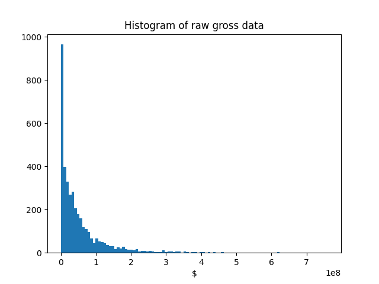
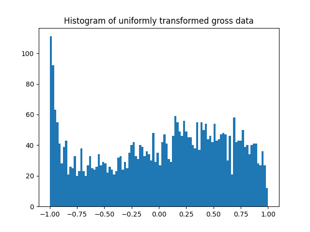

# IMDb Score Prediction

The Internet Movie Database (IMDb) is a website owned by Amazon that assigns a score from 1 to 10 to movies based entirely on user votes. Our goal of this project was to see if we could predict the IMDb score of movies reasonably accurately (±1 star) using a variety of machine learning models. We took 2 different approaches: (1) predicting IMDb score using features that are available before a movie’s release and (2) seeing how well a machine can learn the voting habits of the public. Some of the features used in the second approach are only available after a movie is released, and thus an official IMDb rating would already be applied, rendering prediction pointless.

 A major concern we had was if something so subjective (movie quality) could be learned by a learning model, but even our initial results exceeded our original goal. After further data manipulation and hyperparameter adjustment, we achieved an average high score of predicting within ±0.479 stars including the post-release features, and ±0.554 stars without the post-release features. These results suggest that movie rating habits of humans can be learned to a degree by a machine using concrete data.

## Introduction

Movies cost an individual time and money, and as a result, consumers often look to reviews as an indicator as to whether a given movie will be worth the investment. Some individuals prefer reviews by professional critics, but studies have also shown that reviews by fellow consumers can have an even greater effect on someone’s likelihood of viewing a given movie.

The Internet Movie Database (IMDb) is a project originally created by fans where vacillating movie-goers could see ratings and reviews done by fellow consumers. Once a movie is shown to the public, users on IMDb can give a score for that movie from 1 to 10. The votes are then tallied up and weighted to produce a single score. There are no prerequisites to vote on any given movie other than having a free IMDb account. As a result, the IMDb score of a movie can simply be an arbitrary value assigned by the public. This was one of the major concerns for our project’s goal, which is whether this problem could be learned by a machine using numerical data. 

We wanted to analyze various numerical features to determine if a score so arbitrary can indeed be predicted with concrete data, such as a movie’s gross or genre. If this is the case, then movie producers can gauge ahead of time what sort of features a movie would need to be well-received by the public.

## Methods

<div align="center">
  
  | Feature Name | Sample Value | Feature Type |
  | :----------: | :----------: | :----------: |
  | `num_critic_for_reviews` | 723 | real |
  | `duration` | 178 | real |
  | `director_facebook_likes` | 0 | real |
  | `actor_1_facebook_likes` | 1000 | real |
  | `actor_2_facebook_likes` | 936 | real |
  | `actor_3_facebook_likes` | 855 | real |
  | `cast_total_facebook_likes` | 4834 | real |
  | `movie_facebooke_likes`* | 33000 | real |
  | `gross`* | 7.605e+08 | real |
  | `genres` | Action/Adventure/Fantasy/Sci-Fi | nominal |
  | `facenumber_in_poster` | 0 | real |
  | `num_user_for_reviews`* | 3054 | real |
  | `num_voted_users`* | 886204 | real |
  | `content_rating` | PG-13 | nominal |
  | `budget` | 2.37e+08 | real |
  | `title_year` | 2009 | real |
  | `imdb\_score` | 7.9 | real (label) |

  Table 1: A sample datapoint with only the selected features and the <br> respective type of each feature. The features with the start (*) next to <br> them indicate that they are only obtainable post-release.
</div>

### Data Acquisition

Data for this experiment was collected from a large CSV file available from [Kaggle](https://www.kaggle.com/). The data in the CSV file was a dump of information regarding thousands of movies and included factors such as a movie’s Facebook likes, actor names, genre, and so on.

### Handling Missing Values

In addition to having many features difficult to implement into a machine learning model (e.g. director names and actor names), the dataset also had dozens of instances with missing values. When the instances with missing values were removed, there were still just under 4,000 instances, so we decided to not implement a method to utilize instances with missing values. From there, we determined which features would contribute to our model’s learning. 

After feature selection and converting nominal data into columns with values of 0 or 1, we had 3827 instances with 48 features each.

### Feature Selection

In the original data, there are a total of 28 features, where one of the features in the average IMDb user rating which is used as our label. Many of these features are either difficult to implement into a machine learning model (e.g. keywords of the plot) or do not add any meaningful information for our task (director and actor names, movie aspect ratio, etc.). For the purpose of this project, we decided to only keep numeric or nominal features. Although it is hard to gain any information from the names of the people involved in the movie, the dataset provides relevant quantitative information with director and actor Facebook likes. Only 17 of the 28 features were decided to be used. A sample datapoint with the selected features is shown in Table 1.

### Feature Engineering

Since most of the features of this data haven't been preprocessed in any way, we thought of different ways to engineer the features in such a way that they would be easily interpretable by different machine learning models. For example, with the features that reflected Facebook likes for actors, movies and directors, similar distribution patterns can be observed; they are not distributed uniformly or normally. The distribution of values was typically high for values around zero and dramatically tapered off from there thus exhibiting the properties of exponential distribution, where the pdf is given by

$$
f(x, \lambda) = 
\begin{cases}
\lambda e^{-\lambda x} & \text{if $x \ge 0$} \\
0 & \text{if $x < 0$}
\end{cases}
$$

Similar patterns appear for data such as the gross and the budget. The histogram of the gross feature is shown in Figure 1.

<div align="center">
  
  
  
  Figure 1: The histogram showing the raw gross data. Notice that most <br> of the data is concentrated between \$0 to \$100 million, while there are a few <br> that are much greater. This shows characteristics of an exponential distribution.
</div>

In order to have a more interpretable features, we wanted the distribution of each of the features to be more normally or uniformly distributed. Since logarithm is the inverse of the exponential function, the log of such features were taken initially. If the raw data were truly exponentially distributed, the log of the data would exhibit characteristics of uniform distribution. However, Figure 2 which is the histogram showing the log of the gross data shows that the resulting distribution is more similar to the normal distribution. This implies that the raw data is distributed similar to an exponential of the normal distribution. Before taking the log, all 0 values of the specific feature were changed to 1 in order to prevent the error of taking the log of 0.

<div align="center">
  
  
  
  Figure 2: The histogram showing the log of the gross data. The resulting <br> distribution is approximately normally distributed with a slight left skew.
</div>

Although the resulting distribution shown in Figure 2 shows a familiar bell curve shape, we can see that the distribution is skewed. This is the case for most all of our continuous features. The slight skew won't affect the interpretability of the feature much, but we wanted to explore further ways to center the distribution. The simplest approach to center a skew is to take p-power of the feature after scaling it to be between 0 and 1 for $p > 0$. We can either take $p > 1$ or $p < 1$ depending on the skew of the distribution. The effect of taking p-power of values between 0 and 1 is shown in Figure 3 When $p < 1$, $x^{p} \ge x$ so it would have the effect of shifting the distribution to the right, and when $p > 1$, $x^{p} \le x$ so it would shift the distribution to the left.

<div align="center">
  
  
  
  Figure 3: The effect of taking the power $p$ or $\frac{1}{p}$ of values between 0 and 1.
</div>

For our example gross data, since the distribution of the log is left skewed, we take the power with $p=3$ to center the distribution after scaling the values to be between 0 and 1. The scaled and centered distribution of gross is shown in Figure 4.

<div align="center">
  
  
  
  Figure 4: The histogram showing the normalized gross data obtained by cubing the <br> log gross values after scaling them to be between 0 and 1.
</div>

Now that the distribution closely resembles a normal distribution, we can use the cdf of the normal distribution in order to transform it into a uniform distribution between -1 and 1. This procedure is described below.

```math
\begin{align*}
  X &\sim N(\mu, \sigma^2) \\
  \frac{(X - \mu)}{\sigma} &\sim N(0, 1) \\
  \Phi(\frac{(X - \mu)}{\sigma}) &\sim \text{Uniform}(0, 1) \\
  -1 + 2\Phi(\frac{(X - \mu)}{\sigma}) &\sim \text{Uniform}(-1, 1)
\end{align*}
```

This procedure is made extremely easy by using the Scipy package `scipy.stats.norm.cdf`. After transforming the data this way, the data should be more uniformly distributed along -1 and 1. The transformed gross data is shown in Figure 5.

<div align="center">
  
  
  
  Figure 5: The histogram showing gross data after it has been transformed <br> to be uniformly distributed along -1 and 1.
</div>

For the nominal features, we broke up their different possible values into separate columns and encoded each instance as a 1 or a 0 for those columns. For example, a given movie could have “Action | Adventure | Drama” as its original “genre” feature, so in our reworked data, it would have a 1 in the action, adventure, and drama columns and a 0 in the other genre columns. A simple one-hot encoding was done for “rating,” since a movie can only have a single rating (e.g. G, PG, PG-13, or R). 

## Experiments

One of the goals of our experiments was to find out how different features and feature engineering can effect the performance of each of the models. For this reason, we decided to use the same model for every experiment so that the hyperparameters of each of the models would be controlled. The models we used are Linear Regression, Multilayer Perceptron, Random Forest, and K-Nearest Neighbor Regressor. We used Scikit-learns implementation for all of these models. 

### Linear Regression

Linear Regression works best for problems of linear nature. The goal of linear regression is to find a line that can best fit the datapoints with respect to the output values. The objective of the linear regression can be summarized as:

$$
\text{minimize}_{\beta} \lVert y - X \beta \lVert
$$

where the $y$ is the output labels and $X$ is the input features. The default hyperparameters were used for this model.

### Multilayer Perceptron

The Multi-layer Perceptron (MLP) model, with only a slight modification from the vanilla Perceptron model, is one of the most powerful machine learning models to date. The model solves a fundamental problem of the Perceptron model by incorporating an activation function, which is a non-linear function that acts on the matrix-vector multiplication output. With the activation function, the model can have multiple layers without them collapsing into an equivalent single layer. This simple change allows the model to learn not only linearly separable data, but non-separable ones as well. For this reason, they are commonly referred to as _universal function approximators_. 

For our experiments, we used sigmoid activation for all layers and used 3 hidden layers of size 100, 200, and 100 nodes. 

### Random Forests

Random forests consistently lie among the top-performing classical machine learning methods. Random forests are an ensemble of decision trees, with each decision tree trained on a subset of the training features and a subset of the training data. For the hyperparameters, the number of estimators was set to 1000 with maximum depth of 30, and the maximum number of features was set to be the square root of the total number of features. 

### K-Nearest Neighbors

K-Nearest Neighbors is an approach that decides the classification of a new data point by taking the mode of the classes of its $k$ nearest neighbors in the data space. The application can extend to regression by taking the average of the neighboring values. Because of the simplicity of the model, the accuracy of this model depends heavily on the choice of the hyperparameters. However, for our tasks, we simply used 10 nearest neighbors in terms of Minkowski distance with uniform weighting.

## Initial Results

<table align="center" >
    <thead>
        <tr>
            <th></th>
            <th colspan="4">Initial</th>
            <th colspan="4">Final</th>
        </tr>
    </thead>
    <tbody>
        <tr>
            <td></td>
            <td>All</td>
            <td>No PR</td>
            <td>No nominal</td>
            <td>Only nominal</td>
            <td>All</td>
            <td>No PR</td>
            <td>No nominal</td>
            <td>Only nominal</td>
        </tr>
        <tr>
            <td>Baseline</td>
            <td>0.819</td>
            <td>0.819</td>
            <td>0.819</td>
            <td>0.819</td>
            <td>0.819</td>
            <td>0.819</td>
            <td>0.819</td>
            <td>0.819</td>
        </tr>
        <tr>
            <td>LR</td>
            <td>0.563</td>
            <td>0.645</td>
            <td>0.638</td>
            <td>0.717</td>
            <td><b>0.507</b></td>
            <td>0.654 </td>
            <td>0.573</td>
            <td>0.717</td>
        </tr>
        <tr>
            <td>MLP</td>
            <td>0.689</td>
            <td>0.708</td>
            <td>0.788</td>
            <td>0.764</td>
            <td><b>0.520</b></td>
            <td>0.672</td>
            <td>0.595</td>
            <td>0.750</td>
        </tr>
        <tr>
            <td>RF</td>
            <td><b>0.480</b></td>
            <td><b>0.555</b></td>
            <td><b>0.519</b></td>
            <td><b>0.736</b></td>
            <td><b><i>0.479</i></b></td>
            <td><b>0.554<b></td>
            <td><b>0.512<b></td>
            <td><b>0.716<b></td>
        </tr>
        <tr>
            <td>KNR</td>
            <td>0.660</td>
            <td>0.697</td>
            <td>0.623</td>
            <td>0.741</td>
            <td><b>0.561</b></td>
            <td>0.686</td>
            <td>0.569</td>
            <td>0.743</td>
        </tr>
    </tbody>
</table>
        
Table 2: The table is divided into 8 columns. “Initial” columns are for those done on the dataset where values were only normalized between 0 and 1. “Final” columns are done on our fully engineered dataset. “All" columns are those that include all of the features including the 5 features only available after a movie’s release, while “No PR” columns do not include those features.

<br>

Our unengineered data ran through several different machine learning implementations provided by Scikit-learn. For all the different models, we used 7-fold cross validation for scoring. Mean absolute error was used as the metric. The initial results can be seen in Table 2.

Our results will be compared to a baseline value. This was obtained by finding the average error of all IMDb scores to the mean IMDb score. This value comes out to be within ±0.819 stars. Anything smaller than this error margin is considered an improvement over the naive solution, while anything larger is so inaccurate that it is worse than a simple averaging of errors.

## Final Results

The final results were obtained using our modified dataset that used the engineered features. All of the results are also shown in Table 2.

### Post-release Features Included

Most of the models achieved an error margin significantly lower than the baseline when the post-release features were included (~ 0.3 stars). The lowest error margin we were able to obtain was using the Random Forest model, which came out to be ±0.479 stars (~0.35 stars lower than baseline). This equates to an overall window of error of 0.958 stars, which is just under half of the size of the window where most ratings fall, which is between 6 and 8. We were satisfied with this final result because our model could predict the IMDb rating of a movie and be off by less than half of a star on average. These results suggest that there is actually a decently high correlation between movie rating habits and concrete data. 

The Linear Regression and Multilayer Perceptron models performed relatively the same, yet K-Nearest Regressor got a much higher error margin. K-Nearest Regressor’s increase in error could be due to the high number of features causing neighbor calculation to not be as helpful as we had hoped. 

### Post-release Features Excluded

When the post-release features were excluded, none of the models did significantly better than the baseline except for Random Forest. Random Forest achieved the lowest error margin of ±0.554, which is about 0.28 less than the baseline’s error margin. This means that our model can predict the IMDb score of a movie before it is even released and gets assigned an official score and be off by 0.554 stars on average. 

The error margin being higher when excluding the post-release features suggests that events that occur after a movie has been released affect the quality of it in the eyes of consumers. This notion reinforces the idea that public opinion (e.g. reviews/ratings) and how much money a movie makes can change people’s perception of a movie’s quality. 

### Nominal Features

More experiments were conducted to see the effect of nominal features (e.g. Genre and Rating). Post-release features were always included. The condition of the experiment was to run data without the nominal features and with nothing but the nominal features. Excluding nominal features hurt the accuracy of the models. For example, MLP with the nominal features in the final results got ±0.520 and without them got ±0.595. Including the nominal features improved the accuracy by 0.075 in this instance.The nominal features alone got ±0.750. This is not effective since it is so close to our baseline. For Linear Regression excluding the nominal features increased the error by 0.066. 
Nominal features make a difference to scoring. Using them alone is ineffective and excluding them harms the accuracy. The best score from all experiments was 0.479. Running the same thing without the nominal features was 0.513. These both occurred on Random Forest. These results suggest that genre and rating have an effect on people’s perception of a movie’s quality.

## Conclusion

The success of our chosen models with our minimally altered dataset was exciting. By only removing instances with missing values, excluding difficult to implement features and normalizing all chosen features we achieved excellent error margins hovering around one half stars on both our initial and final experiments. The results were always below our baseline error of ±0.819 stars. 

The best result, an error margin of ±0.479, was obtained using the Random Forest model on the engineered dataset with all the features. A similar result, ±0.480, was also seen using the Random Forest model on the unengineered dataset with all the features. The similarities between these two scores is due to how the Random Forest algorithm works. The algorithm will split features to make separate branches for each individual decision tree. This splitting is not as hindered by clustered data, so making the data uniform or normal will not have much effect on the outcome. Other models, such as Multilayer Perceptron, are heavily influenced by feature engineering because it helps the model differentiate between data that is all clustered in a small range. This effect is seen in Table 2 (±0.689 for unengineered vs. ±0.520 for engineered).

Overall these errors are splendid. Nominal Features matter and post-release features made a difference but not by much. Knowing this we can predict the IMDb score of any film with high confidence before it’s released to the public. 

## Future work

We have an adequate machine for predicting IMDb scores for movies before and after their release. Any further work will be done to narrow the margin of error. The process for choosing our hyperparameters for the models was sporadic and subjective. The chosen parameters likely reflect some local minimums but there probably exists room to improve. We can implement a grid search to find the best possible combinations of parameters to get the best possible results. We could also use more features from the original dataset. They appear to be useless but perhaps after finding ways to implement them they could be of value to the problem.
